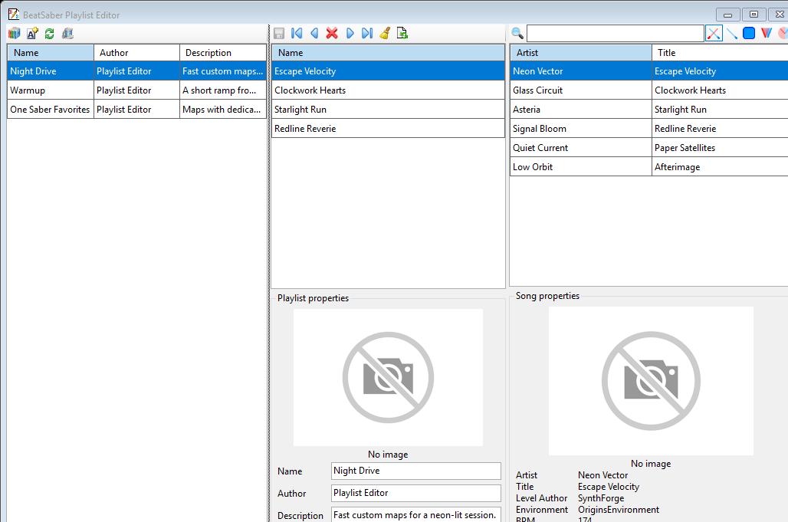

# 🎵 BeatSaber Playlist Editor

> A Windows desktop application for creating and managing Beat Saber playlists on PC and modded Meta Quest installations — browse, reorder, add cover art and save playlists without hand-editing JSON.

_The screenshot is generated from the current application build by GitHub Actions with deterministic sample playlists and songs, so the README shows the real UI populated with representative data instead of an aging hand-made capture._

## ✨ Features

* **Playlist Management:** Create, delete, and edit playlists.
* **Customization:** Change playlist name, author, description and cover image.
* **Song Library:** Browse and search custom songs.
* **Drag & Drop:** Drag songs from the library into a playlist.
* **Song Ordering:** Arrange playlist entries exactly as wanted.
* **Fast Filtering:** Search and game-mode filters reuse the loaded song model instead of rescanning the installation for every UI change.
* **PC + Quest:** Work directly with Steam/Meta PC installations or a modded Quest connected through ADB.
* **Playlist Formats:** Reads `.json`, `.bplist` and `.blist` playlists, including playlist subfolders.
* **Save & Refresh:** Save edits and explicitly refresh libraries from disk/device.

## 📦 Getting Started

Click the folder/connect button and choose the source:

* **No — PC installation:** select the Beat Saber installation directory used by Steam or the Meta/Oculus PC app. The selected directory must contain `Beat Saber_Data`.
* **Yes — Meta Quest:** connect an authorized Quest through USB/ADB. The editor mirrors the mod data, edits it locally and synchronizes playlist changes back to the headset.
* **Cancel:** leave the current source unchanged.

After connecting:

1. Select a playlist on the left, or create one with `➕`.
2. Drag songs from **Available Songs** into the playlist.
3. Reorder or remove entries with the arrow/remove buttons.
4. Edit name, author, description or cover image.
5. Click `💾` to save. For Quest, saving also pushes the playlist data back to the headset.

## 🥽 How do I use this with Quest?

> **“Do I need to somehow copy the Beat Saber installation file from Quest to my PC?”**

**No. Do not copy the Beat Saber APK or the complete Quest installation to the PC.** The Quest version stores modded custom songs and playlists in its shared mod-data area, and the editor can access that data directly through Android Debug Bridge (ADB).

Requirements:

1. Beat Saber on Quest must be modded for custom songs.
2. SongCore (or the legacy SongLoader layout) must contain the custom levels.
3. PlaylistManager must be installed for in-game custom playlist support.
4. Quest **Developer Mode / USB debugging** must be enabled.
5. Connect the headset to the PC with USB and accept the **Allow USB debugging** prompt inside the headset.
6. Install Android Platform Tools so `adb.exe` is available on `PATH`, or set the `ADB_PATH` environment variable to the full path of `adb.exe`.
7. In BeatSaber Playlist Editor, click the connect button and choose **Yes — Meta Quest**.

The editor currently understands these Quest locations:

* SongCore custom levels: `/sdcard/ModData/com.beatgames.beatsaber/Mods/SongCore/CustomLevels`
* Legacy SongLoader custom levels: `/sdcard/ModData/com.beatgames.beatsaber/Mods/SongLoader/CustomLevels`
* PlaylistManager playlists: `/sdcard/ModData/com.beatgames.beatsaber/Mods/PlaylistManager/Playlists`

If multiple Android/Quest devices are connected, the API also supports selecting an ADB serial explicitly through `BeatSaberInstallation.FromQuest(adbPath, serial)`.

## 💻 Platform support

| Platform | Status | How it works |
| --- | --- | --- |
| Steam / SteamVR on Windows | ✅ Read/write | Select the Beat Saber installation directory. |
| Meta/Oculus PC (Rift/Rift S/Quest Link PC build) | ✅ Read/write | Select the Beat Saber installation directory. |
| Meta Quest standalone | ✅ Read/write for modded custom content | Connect through USB/ADB; SongCore/SongLoader levels and PlaylistManager playlists are mirrored and synchronized automatically. |
| PlayStation VR / PlayStation VR2 | 🚫 Platform limitation | Beat Saber does not expose custom levels/user-generated playlist storage on PlayStation, so a desktop playlist editor has nothing writable to connect to. |

The application itself targets **.NET 10 / C# 14** and is published as a self-contained Windows x64 executable.

## 🏛️ Architecture

This project demonstrates a unique approach by applying the **Model-View-ViewModel (MVVM)** pattern to a **Windows Forms** application. While typically associated with newer frameworks like WPF and MAUI, this architectural choice brings several key benefits:

* **Separation of Concerns:** The UI (View) is decoupled from the application logic (ViewModel), leading to a cleaner and more organized codebase.
* **Enhanced Testability:** With the logic isolated in the ViewModel, it can be unit-tested independently of the UI, ensuring greater stability and reliability.
* **Improved Maintainability:** This separation makes the project easier to understand, debug, and extend over time.

It serves as an interesting case study for applying modern design patterns to classic UI frameworks.

## ❤️ Support

If this project saves you time or money, consider supporting its development:

## 📜 License

Licensed under LGPL-3.0-or-later — see [LICENSE](LICENSE).
